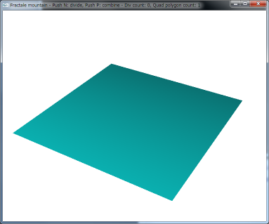
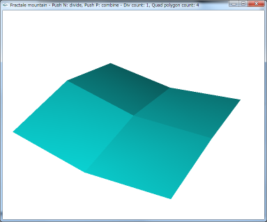
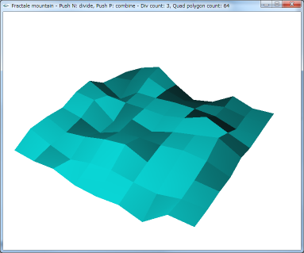
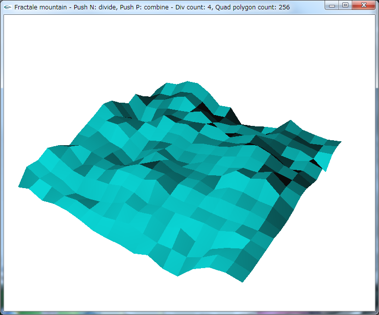
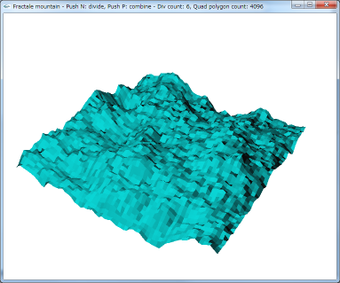
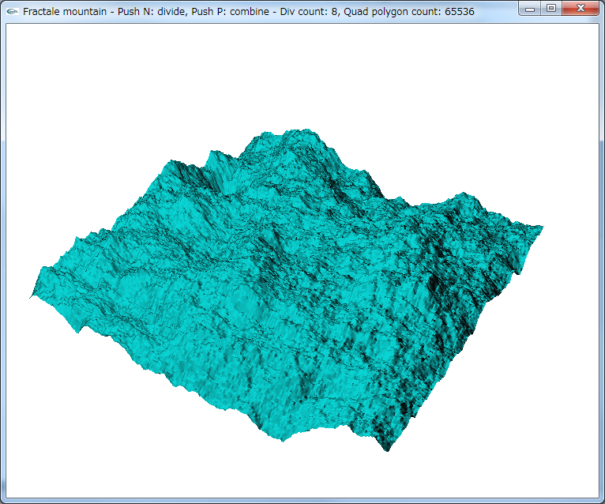

midpoint_displacement_algorithm
===============================

3Dメッシュに対して中点変位法を行うプログラムです。
Windows上でOpenGL使って書いています。
でもWindows依存なコードは書いていないはず。

操作方法
n: 分割数を増やす
p: 分割数を減らす
十字キーの左右: カメラ回転

分割数が1増えるとポリゴンの数が4倍になるので、ある程度分割すると処理が一気に重くなります。

0分割

1分割

3分割

4分割

6分割

8分割

